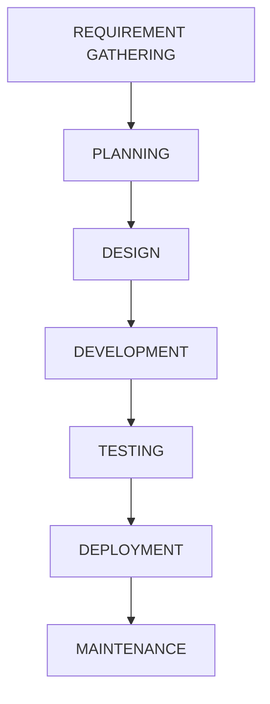
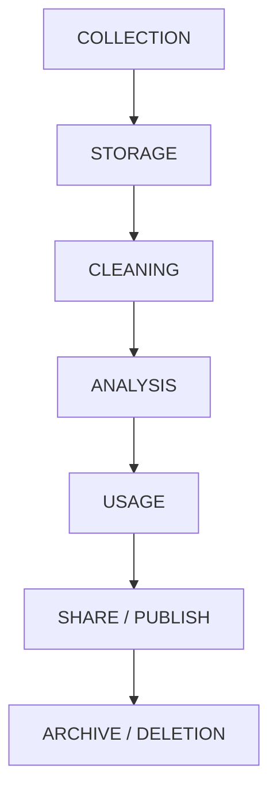
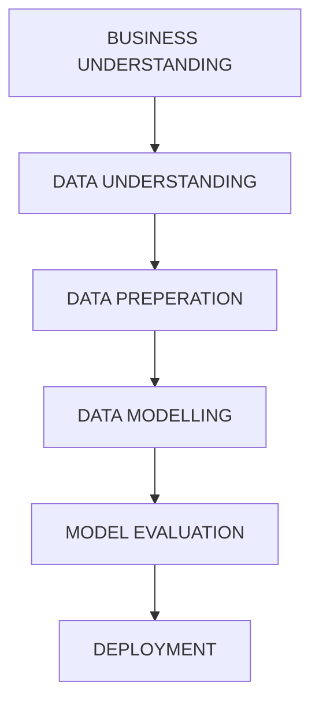
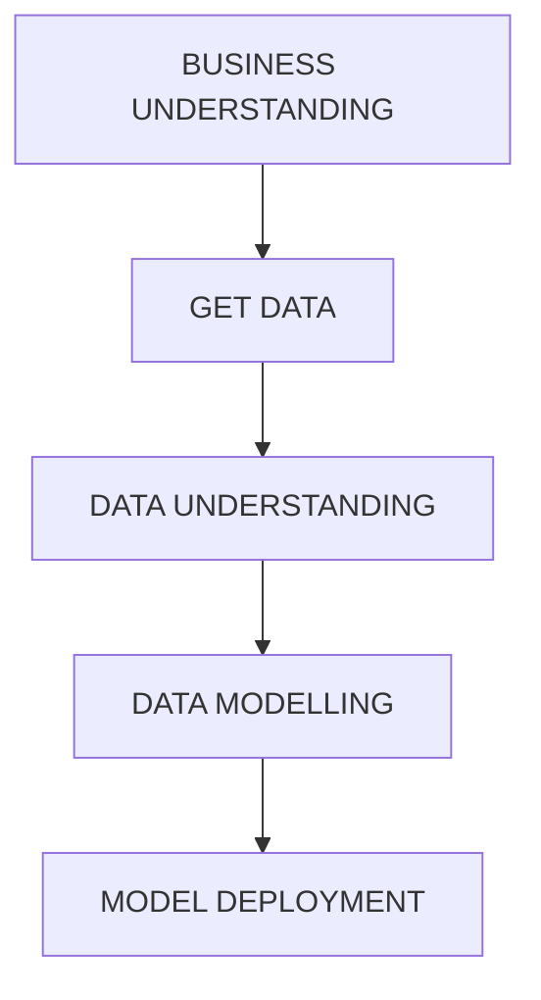
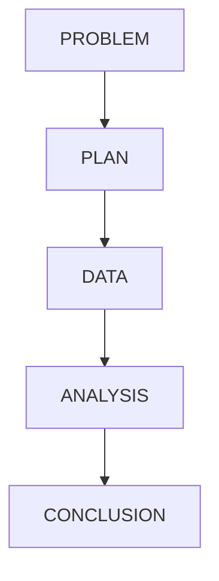

## Methodologies and Documentation
- various methodologies and documentation concept
- ***to organize teams, solve problems and produce high quality results***

## SLDC - Software Development Lifecycle:
used for building software step by step 

## Data Life Cycle
how data is created managed used retired

## Agile
- its the parent to Scrum
- **Deliver quickly and adapt to change**
    - work in <mark>sprints</mark>
    - get <mark>feedback regularly</mark>
    - <mark>adapt</mark>to change

## CRISP-DM - Cross-Industry Standard Process for Data Mining
process for data science and mining

## TDSP / TSDP - Team Data Science Project
team process for machine learning projects 

## PPDAC - Problem, Plan, Data, Analysis, Conclusion
used for research and statistics 

