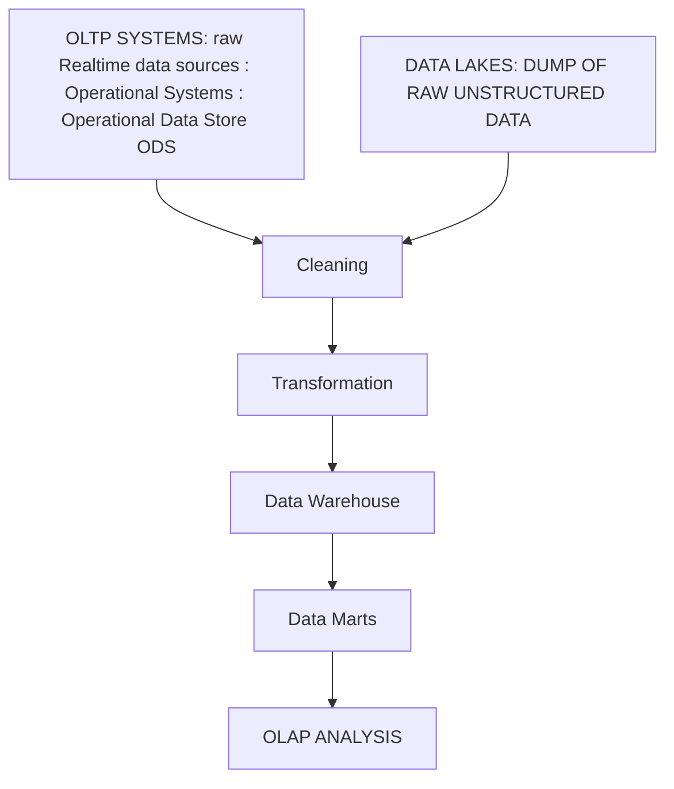

 | OLTP ( Online Transaction Processing) | OLAP (Online Analytics Processing) |
 | :---: | :---:|

- its <mark>not a question of choosing between OLAP and OLTP </mark>
- its about how to make the <mark>best use of both of the processes</mark> for our situation
- OLTP is purely ***operational*** and OLAP is used to ***gain valuable insights***

## OLAP
1. System to perform **Multi Dimensional Analysis** at **High Speeds** on **Large Data Volumes (large amount of data)**
2. the **data comes from** a data warehouse, a data mart or any **centralized** clean non volatile data **source**
3. <mark> SUBJECT ORIENTED </mark>
4. ideal for tasks such as:
    - data mining
    - business intelligence
    - complex analytical calculations, etc
    - business reporting 
        - financial analysis
        - budgeting
        - sales forecasting
5. Core of most OLAP databases is OLAP cube : 
    - allows us to quickly query , report on and analyze this dimensional data [OLAP cube](https://youtu.be/iw-5kFzIdgY?si=68pPAMECM9QjFKQq&t=106)
    - data dimension : is one element of a data set
        - sales figures may have several dimension related to region, time, and product
        - OLAP cube extends the row column format of a traditional database and adds a layer on top of other dimensions (row and columns + multiple sheets: like a stack of paper)
        - the top layer of the cube may organize sales by region it can also be drilled down to layers for sales by state, sales by city, or sales by a particular store
        

    - this is why <mark>data warehoused OLAP system are considered 3D</mark>
6. this is a ***decision support system***
7. historical, cleaned, precise
8. STAR SCHEMA, SNOWFLAKE SCHEMA (it is a extended version of star schema)
9. NOT ALL OLAPS ARE CUBE BASED 
10. priority for ***HEAVY COMPLEX QUERIES***
11. aggregate data (sum, avg, max, group by, etc)
12. drilled down - more detail, roll up - more summary

## OLTP
1. enables <mark> real time execution of large number of database transactions </mark> by multiple users
2. behind many day to day transactions such as:
    - atm
    - in store purchases
    - hotel reservations
3. also drives any non financial transactions like:
    - password changes
    - social media messages
4. Use ***Relational Databases*** for doing things like insertion updates and deletion to data 
5. rapid processing
6. multi user access to the same data while ensuring data integrity
7. provide indexed dataset for rapid searching, retrieval and querying
8. <mark>APPLICATION ORIENTED</mark>
9. Realtime, current, and detailed
10. ER, ERD, LOGICAL DIAGRAM, COMPOSITION DECOMPOSITION
11. <mark>avoid expensive queries</mark> like multiple joins as they slow down transactions
12. are ***highly normalized*** to avoid redundancy and mantain data quality

> for college definitions are fine, however skim through the OLAP AND OLTP points to understand the differences cause it has been discussed in the lectures though not boldly present in the slides

## Combining OLTP and OLAP
organizations use OLTP to provide Data to OLAP

> OLAP IS NOT DATA WAREHOUSE: SO THINK OF DATA WAREHOUSE AS A LIBRARY WHERE ALL THE BOOKS ARE STORED IN AN ORGINED WAY   OLAP IS THE METHOD USE TO ANALYZE THE CONTENTS OF THE BOOK AND THEN DECIDE WHICH BOOK IS GOOD WHICH IS NOT   DATA WAREHOUSE FEEDS DATA TO OLAP

 

> user needs to know what they want, day to day OLTP, analysis OLAP, both go for both like most organizations

## OLAP CUBE SELF MADE EXAMPLE
              Months
        Jan  Feb  Mar
    Items
        Pant     6    7    1   <- Store1
        Shirt   400  500  600
-- SHEET OF PAPER --

    Items
        Pant     4    8    2   <- Store2
        Shirt   300  450  500

## IMPORTANT
1. DATA WAREHOUSE <mark> IS NOT 3 DIMENSIONAL IT IS JUST A LARGE CLEANED ORGANIZED NON-VOLATILE DATABASE</mark>
2. ITS THE ANALYSIS PROCESS <mark>OLAP THAT IS 3 DIMENSIONAL</mark>
3. OLAP models are built on top of the data warehouse and are 3D in nature
4. OLTP Is normalized but OLAP is not as to make reads faster

## Reference 
> https://www.youtube.com/watch?v=iw-5kFzIdgY
