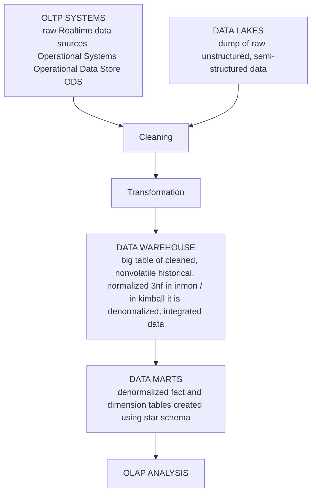

## Introduction
1. is a database design used in data warehouse, OLAP, and BI 
2. a lot of modelling techniques inmon, kimball, data vault, one big table but the most popular one is ***Kimballs Dimensional Modelling*** as it is
    1. simple: analysts, engineers find it easy to understand
    2. optimized for analytics: designed to support, dashboards, reporting, and OLAP operations 
    3. High Performance: denormalized dimension tables, and straight forward joins = faster query
    4. Tooling and industry adoption: it is the most used method in modern warehouses and bi tools
    5. Scalable: can be expanded to areas required by the subject
3. main purpose is to organize data in such a way that query are fast, simple and can help to carry out efficient analysis

> kimball is one of the most influential figures in the field of data warehouse and business intelligence. Kimball popularized dimensional modeling and the bottom-up approach (building data marts first, organizing the data marts into star schemas, and then integrating them)

## Star Schema Flow

## Star Schema / Kimball Modelling process:
1. identify a fact i.e what is the business activity
    - what is the main business activity we wanna analyze
2. determine dimensions i.e attributes and descriptions 
around the fact 
    - what tables are gonna support your fact
3. Granularity i.e the level of detail for the fact table
    - do we want one row per transaction, one row per day
4. create star schema / marts: things we want the end user to interact with 

> when all the data about a transaction are stored in a single table it is known as highly denormalized database - used in star schema

## FACT TABLE
1. store composite primary key ( Date_id + Product_id + etc...)
2. store factual or quantitative data ( data with quantity sales amount, quantity sold, revenue, cost, etc.)
3. Generated by business events (records of what happened in the business)

## DIM TABLE
1. simple and non composite primary key (customer_id)
2. all the attributes of the fact (time_id > month, year, hour, etc)

## IMPORTANT
1. Star schema uses simple joins and not complex joins. 
2. High Granularity means detailed facts = level of detail
3. Kimball Bottom -Up approach 
4. Inmon Top down Approach
5. Star schema = fact + dimension tables
6. fact table hold measure, numeric data
7. dimension table hold context
8. fact table contain composite key
9. star schema is faster than snowflake as snow flake has adds normalization -> i.e more joins needed
10. Facts = long & narrow table; Dimensions = short & wide table

## Reference
>https://www.youtube.com/watch?v=gRE3E7VUzRU

>https://www.geeksforgeeks.org/dbms/star-schema-in-data-warehouse-modeling/