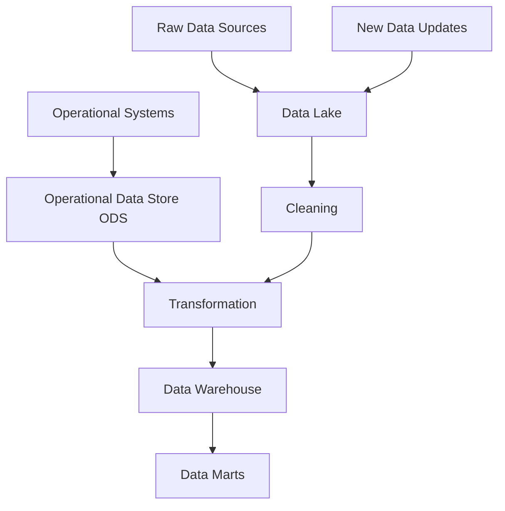
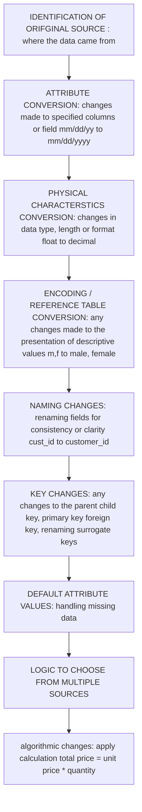

 ## what is a data warehouse
 reference video : 
> [what is a data warehouse by IBM Technology](https://www.youtube.com/watch?v=k4tK2ttdSDg) 
> [what is a data warehouse by 365 data science](https://www.youtube.com/watch?v=AHR_7jFCMeY&pp=ygUOZGF0YSB3YXJlaG91c2U%3D)

 1. <mark>EDW = enterprise data warehouse</mark> and <mark>INMON</mark> is considered as the father of data warehouse
 2. =<mark>data lakes, data warehouse, and data marts</mark> are different things
    - **data lakes**: 
        - has a <mark>dump of all raw  unstructured data</mark> in a quick way to organize later 
    - **data warehouse**:
        - purpose specific than data lake
        - <mark>arge collection of organized cleaned data</mark> that can be used by the organization to make business decisions 
        - help to <mark>upport decision support system</mark> (Data warehouses enable reporting, analysis, and decision-making)
    - **data mart**:
        - subset of data warehouse
        - <mark>specific to a certain domain</mark>
3. **Data warehouse** 
    - is a <mark>point of truth</mark> across multiple knowledge domains (<mark>structuring best quality data in one place</mark>)
    - step 1::: the data comes from multiple <mark>different sources and system</mark>
    - step 2::: the data is ***transformed from a raw form to a high quality one (information)*** which is ***optimized for analytics via ETL(extract, transform, and load tools)*** 
    - step 3::: data could <mark>cover multiple domains=</mark> like customer data, sales, data, erp data, supply chain data, etc
    - step 4::: after this the <mark>extracted data is cleaned, transformed and loaded</mark> 
    - step 5::: the data is exposed for use which then people perform ai/ml analysis on, users can be business analysists, data scientists, data engineers
    -  step 6::: they further process the data using tools in the data warehouse or using bi intelligence tools
    - ***for data warehouse to be effective it must be*** :
        1. consistent
        2. well integrated
        3. well designed
        4. time stamped
    - ***data warehouse has its own environment as well, it can be further broken down***
        1. data store: 
            - all cleaned, and integrated data stored in one place
        2. data mart: 
            - cleaned data stored in data store is <mark>broken down into smaller segments for specific department</mark>
            - if sales needs it is broken into sales data, if needed for supply chain analysis broken down for supply chain data
        3. metadata : 
            - just <mark>basic information about the data</mark> that makes it easier to understand what type of data we are dealing with
            - explains what the data is, where it came from, and how it is structured
            - making it easier to understand the data and use it
    > **MAJORLY USED FOR DATA REPORTING AND ANALYSIS PURPOSE**
4. 3 common way data warehouse can be deployed: 
    - on premise
    - cloud
    - hybrid
5. **features of a data warehouse**
    1. **subject oriented** : information revolves around a subject, only subject of interests, designed for analysis
    2. **Integrated** : picking the best quality data from everywhere such as from different file types, different systems, different naming conventions, different databases, etc, and bringing them all to a globally accepted standard like proper naming schemes and accuracy
    3. **Time-Variant** : data warehouse always contains historical data, hence why it is used for analysis and reporting, but the historical data should be accurate to its entries
    4. **Non volatile** : data flows in the data warehouse as it is once in there it can not go out, or be changed
    5. **summarized** : aggregated or segmented in a way which is useful for analysis and reporting
    6. **Large Volume** : have a large number of data sets
    7. **Metadata** : Data about the data are stored
    8. **Data from external sources** : data comes from operational data storage, data lakes, and many other sources
    9. **Not Normalized** : data is in an non normalized form

6. **Application Oriented vs Subject Oriented**:
    1. **application oriented**
        - this is used for <mark>day to day operations</mark>
        - real time
        - stores all detailed transactions in real time
        - a database the company uses in a day to day operation
    2. **subject oriented**
        - used for <mark>analysis, reporting, dashboards, forecasting</mark>
        - stores clean, historical, integrated data
        - organized by subject ( then end goal, user)
        - not updated in real time
        - used for analysis
## Functioning Of A Data Warehouse - data movement

**Data Warehouse = has all the cleaned data**
**Data Mart = specific subject oriented slice of the warehouse**
**Operational Data Store = provides up-to date real time data, and feeds that cleaned integrated data into data warehouse**

## Components of a Metadata
- information that is kept about the warehouse 
- <mark>data about the data</mark>
- components of the metadata:
    1. **transformation maps**: how the data has been transformed from raw to clean data
    2. **extraction and relationship history**: how the data was pulled and how does it relate to other data
    3. **algorithms for summarizations**: formulas and techniques available to summarize / analyze our data
    4. **data ownership**: source and owner of each piece of data
    5. **pattern of access**: who accessed, what accessed, how many times accessed 

## Transformation Mapping Records
- metadata that <mark>documents how data is transformed before it enters the data warehouse</mark>
- it includes:

## Data Warehouse Architecture - layers of data warehouse
1. **operational and external database layer** 
    - has the raw data that is uncleaned and will be processed to be fed into data warehouse
2. **information access layer** 
    - bridge between source system and data warehouse 
    - does ETL 
    - preparing data before it goes into the warehouse
3. **data access layer** 
    - allows people to access the cleaned information from the warehouse
4. **metadata layer** 
    - has the data about the data

---
DAY TO DAY OPERATIONS => OLTP => TRANSACTION PROCESSING => ONLINE TRANSACTION PROCESSING
STORAGE CLEANED FOR ANALYSIS => OLAP => ANALYTICAL PROCESSING => ONLINE ANALYTICAL PROCESSING 
